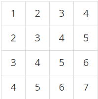

# 2주차

- 주제: 자료구조

## 공부 정리
- [수연](../../풀이/수연/2주차/풀이.md)
- [승현](../../풀이/승현/2주차/Study.md)

## 004 구간 합 구하기 2

### 문제 링크
- 백준) https://www.acmicpc.net/problem/11660 (실버1)
- 책) 'Do it! 알고리즘 코딩테스트 - 자바편' 47p 

### 문제
N×N개의 수가 N×N 크기의 표에 채워져 있다. (x1, y1)부터 (x2, y2)까지 합을 구하는 프로그램을 작성하시오. (x, y)는 x행 y열을 의미한다.

예를 들어, N = 4이고, 표가 아래와 같이 채워져 있는 경우를 살펴보자.

여기서 (2, 2)부터 (3, 4)까지 합을 구하면 3+4+5+4+5+6 = 27이고, (4, 4)부터 (4, 4)까지 합을 구하면 7이다.

표에 채워져 있는 수와 합을 구하는 연산이 주어졌을 때, 이를 처리하는 프로그램을 작성하시오.

### 풀이
  - [보영](./README.md)
  - [수연](../../풀이/수연/2주차/ex04.java)
  - [승현](../../풀이/승현/2주차/Ex04.java)
  - [인호](../../풀이/인호/2주차/Ex004.java)
  - [현화](../../풀이/현화/2주차/Main004.java)

## 005 나머지 합 구하기

### 문제 링크
- 백준) https://www.acmicpc.net/problem/10986 (실버4)
- 책) 'Do it! 알고리즘 코딩테스트 - 자바편' 52p 나머지 합 구하기

### 문제
수 N개 A1, A2, ..., AN이 주어진다. 이때, 연속된 부분 구간의 합이 M으로 나누어 떨어지는 구간의 개수를 구하는 프로그램을 작성하시오.

즉, Ai + ... + Aj (i ≤ j) 의 합이 M으로 나누어 떨어지는 (i, j) 쌍의 개수를 구해야 한다.

### 풀이
  - [보영](./README.md)
  - [수연](../../풀이/수연/2주차/ex05.java)
  - [승현](./README.md)
  - [인호](../../풀이/인호/2주차/Ex005.java)
  - [현화](../../풀이/현화/2주차/Main005.java)

## 006 연속된 자연 수의 합 구하기

### 문제 링크
- 백준) https://www.acmicpc.net/problem/2018 (자연 수 합 - 실버5)
- 책) 'Do it! 알고리즘 코딩테스트 - 자바편' 56p
- 
### 문제
어떠한 자연수 N은, 몇 개의 연속된 자연수의 합으로 나타낼 수 있다. 당신은 어떤 자연수 N(1 ≤ N ≤ 10,000,000)에 대해서, 이 N을 몇 개의 연속된 자연수의 합으로 나타내는 가지수를 알고 싶어한다. 이때, 사용하는 자연수는 N이하여야 한다.

예를 들어, 15를 나타내는 방법은 15, 7+8, 4+5+6, 1+2+3+4+5의 4가지가 있다. 반면에 10을 나타내는 방법은 10, 1+2+3+4의 2가지가 있다.

N을 입력받아 가지수를 출력하는 프로그램을 작성하시오.

### 풀이
  - [보영](./README.md)
  - [수연](../../풀이/수연/2주차/ex06.java)
  - [승현](../../풀이/승현/2주차/Ex06.java)
  - [인호](../../풀이/인호/2주차/Ex006.java)
  - [현화](../../풀이/현화/2주차/Main006.java)
