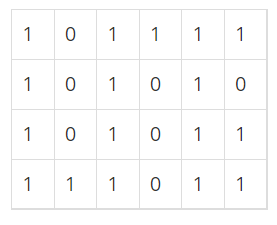
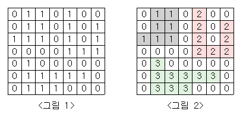

# 6주차

- 주제: BFS

## 공부 정리
- [수연](../../풀이/수연/6주차/Study.md)
- [승현](../../풀이/승현/6주차/Study.md)
- [보영](../../풀이/보영/6주차/readmd.md)

## 026 DFS와 BFS 프로그램

### 문제 링크
- 백준) https://www.acmicpc.net/problem/1260 (DFS와 BFS - 실버2)
- 책) 'Do it! 알고리즘 코딩테스트 - 자바편' p.164
- 
### 문제
그래프를 DFS로 탐색한 결과와 BFS로 탐색한 결과를 출력하는 프로그램을 작성하시오.  
단, 방문할 수 있는 정점이 여러 개인 경우에는 정점 번호가 작은 것을 먼저 방문하고, 더 이상 방문할 수 있는 점이 없는 경우 종료한다. 정점 번호는 1번부터 N번까지이다.  
  
### 풀이
  - [보영](../../풀이/보영/6주차/ex26.java)
  - [수연](../../풀이/수연/6주차/ex26.java)
  - [승현](../../풀이/승현/6주차/Ex26.java)
  - [인호](../../풀이/인호/6주차/P026.java)
  - [현화](../../풀이/현화/6주차/Main026.java)

## 027 미로 탐색하기

### 문제 링크
- 백준) https://www.acmicpc.net/problem/2178 (미로 탐색 - 실버1)
- 책) 'Do it! 알고리즘 코딩테스트 - 자바편' p.169

### 문제  
N×M크기의 배열로 표현되는 미로가 있다.  
  
  

미로에서 1은 이동할 수 있는 칸을 나타내고, 0은 이동할 수 없는 칸을 나타낸다. 이러한 미로가 주어졌을 때, (1, 1)에서 출발하여 (N, M)의 위치로 이동할 때 지나야 하는 최소의 칸 수를 구하는 프로그램을 작성하시오.  
한 칸에서 다른 칸으로 이동할 때, 서로 인접한 칸으로만 이동할 수 있다.  
  
위의 예에서는 15칸을 지나야 (N, M)의 위치로 이동할 수 있다. 칸을 셀 때에는 시작 위치와 도착 위치도 포함한다.  
  
### 풀이
  - [보영](../../풀이/보영/6주차/ex27.java)
  - [수연](../../풀이/수연/6주차/ex27.java)
  - [승현](../../풀이/승현/6주차/Ex27.java)
  - [인호](../../풀이/인호/6주차/P027.java)
  - [현화](../../풀이/현화/6주차/Main027.java)

## 028 단지번호붙이기

### 문제 링크
- 백준) https://www.acmicpc.net/problem/2667 (단지번호붙이기 - 실버1)

### 문제
<그림 1>과 같이 정사각형 모양의 지도가 있다. 1은 집이 있는 곳을, 0은 집이 없는 곳을 나타낸다.   
철수는 이 지도를 가지고 연결된 집의 모임인 단지를 정의하고, 단지에 번호를 붙이려 한다. 여기서 연결되었다는 것은 어떤 집이 좌우, 혹은 아래위로 다른 집이 있는 경우를 말한다. 대각선상에 집이 있는 경우는 연결된 것이 아니다.  

<그림 2>는 <그림 1>을 단지별로 번호를 붙인 것이다. 지도를 입력하여 단지수를 출력하고, 각 단지에 속하는 집의 수를 오름차순으로 정렬하여 출력하는 프로그램을 작성하시오.  

  
  
    
  
### 풀이
  - [보영](../../풀이/보영/6주차/ex28.java)
  - [수연](../../풀이/수연/6주차/ex28.java)
  - [승현](../../풀이/승현/6주차/Ex28.java)
  - [인호](../../풀이/인호/6주차/P028.java)
  - [현화](../../풀이/현화/6주차/Main028.java)
