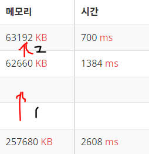

## 풀이
### 시간 복잡도

원래 주어진 N개의 배열로 M번의 계산의 합을 진행하면 => 시간복잡도: O(N*M) - N번의 덧셈을 M번 수행
1 ≤ N ≤ 100,000
1 ≤ M ≤ 100,000
최대 10만번 * 10만번 = 1000억번 = 1000초 
(*보통 1억번의 연산하는데 걸리는 시간 1초)
=> 제한시간 1초라서 시간 복잡도를 줄이는 방법을 찾아야함


SUM 들의 배열을 저장하기
ex)
arr : 1 2 3 4 5 6 7 8 9 10
sum : 1 3 6 10 15 21 28 36 45 55
3-10번째까지: 3+4+5+...+10 -> (1+2+3...+10번째 합) - (1+2번째 합)
-> 일반화 : start-end까지 합: (end까지 합) - (start-1까지 합)
=> O(N)


## 메모리 & 시간 효율화



### 1. BufferedReader

```
  BufferedReader br = new BufferedReader(new InputStreamReader(System.in));
  StringTokenizer st = new StringTokenizer(br.readLine());
  int n = Integer.parseInt(st.nextToken());
```
[BufferedReader VS Scanner](https://lasbe.tistory.com/48)


### 2. StringBuilder
```
  StringBuilder sb = new StringBuilder(); //객체 생성
  sb.append(res + "\n");    //필요한 곳에서 결과 저장
          
  System.out.println(sb.toString());  //한번에 출력
  
```
[StringBuilder란](https://hardlearner.tistory.com/288)
